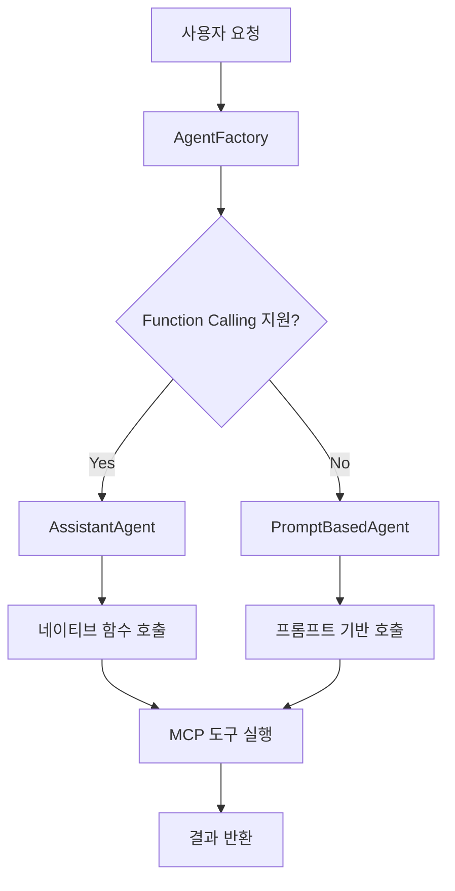

# AutoGen-MCP Agent3 🤖

## 개요

AutoGen-MCP Agent3는 다양한 LLM 환경에서 **MCP(Model Context Protocol) 도구**를 활용할 수 있는 하이브리드 AI 에이전트 시스템입니다. Function calling을 지원하지 않는 로컬 LLM에서도 프롬프트 기반 도구 호출을 통해 강력한 기능을 제공합니다.

## 🌟 주요 특징

### 🔄 하이브리드 Tool Calling 시스템
- **Function Calling**: OpenAI, Claude 등 지원 모델에서 네이티브 함수 호출
- **Prompt-Based**: 로컬 LLM(Ollama, LM Studio 등)에서 XML 스타일 프롬프트 기반 호출
- **자동 감지**: AgentFactory가 LLM 능력을 감지하여 최적의 방식 선택

### 🛠️ MCP 도구 지원
- 시스템 모니터링 도구
- 네이버 검색 API
- 날씨 정보 조회
- 파일 시스템 접근
- 확장 가능한 MCP 서버 아키텍처

### 🖥️ 다양한 인터페이스
- **CLI 모드**: 터미널 기반 대화형 인터페이스
- **Web UI**: Gradio 기반 웹 인터페이스 (도구 호출 과정 시각화)
- **Streamlit UI**: 대시보드 형태의 웹 인터페이스

## 📊 지원 모델 비교

| LLM 유형 | Function Calling | Prompt-Based | 권장도 |
|----------|:---------------:|:------------:|:------:|
| **OpenAI GPT-4/3.5** | ✅ | ✅ | ⭐⭐⭐ |
| **Claude (Anthropic)** | ✅ | ✅ | ⭐⭐⭐ |
| **로컬 LLM (Ollama)** | ❌ | ✅ | ⭐⭐ |
| **LM Studio** | ❌ | ✅ | ⭐⭐ |
| **커스텀 모델** | ❌ | ✅ | ⭐⭐ |

## 🚀 빠른 시작

### 1. 설치

```bash
git clone https://github.com/laurus-kpa007/autogen-agent3.git
cd autogen-agent3
python -m venv venv
venv\Scripts\activate  # Windows
pip install -r requirements.txt
```

### 2. 설정

`orchestrator/config.py` 파일을 편집하여 LLM 설정을 구성하세요:

```python
# LLM 설정
LLM_CONFIG = {
    "base_url": "http://127.0.0.1:1234/v1",  # 로컬 LLM 서버
    "model": "gemma-3-4b-it",
    "api_key": "",  # 로컬 모델의 경우 빈 문자열
}

# OpenAI 사용 시
LLM_CONFIG = {
    "base_url": "https://api.openai.com/v1",
    "model": "gpt-4",
    "api_key": "your-openai-api-key",
}
```

### 3. 실행

```bash
python main.py
```

모드 선택:
- `1`: CLI 모드 (터미널에서 대화)
- `2`: Web UI 모드 (브라우저에서 접근)

## 🏗️ 아키텍처

### AgentFactory 패턴



### 핵심 컴포넌트

- **AgentFactory**: LLM 능력 감지 및 적절한 에이전트 선택
- **PromptBasedAgent**: 프롬프트 기반 도구 호출 처리
- **ToolCallParser**: XML 형식의 도구 호출 파싱
- **MCP Tool Loader**: MCP 서버 연결 및 도구 로딩

## 📖 상세 문서

### 📚 기술 문서
- [**아키텍처 설계**](docs/ARCHITECTURE.md) - 전체 시스템 아키텍처
- [**구현 계획**](docs/IMPLEMENTATION_PLAN.md) - 단계별 구현 가이드
- [**Tool Calling 비교**](docs/TOOL_CALLING_COMPARISON.md) - Function Calling vs Prompt-Based 상세 분석
- [**데이터 플로우**](docs/DATA_FLOW_DIAGRAMS.md) - 시각적 데이터 흐름 분석

### 🔧 사용 예시

#### CLI 모드
```bash
$ python main.py
모드를 선택하세요:
1) CLI
2) Web UI
> 1

🤖 에이전트 생성 완료: {'type': 'PromptBasedAgent', 'function_calling': False, 'tools_count': 3}

질문을 입력하세요 ('exit' 입력 시 종료):
👤: 현재 시스템 상태는 어때?

🛠 도구 'get_system_info' 실행 완료
🤖: 현재 시스템 상태는 다음과 같습니다:
- CPU 사용률: 45%
- 메모리 사용률: 62%
- 디스크 사용률: 78%
```

#### Web UI 모드
```bash
$ python main.py
> 2

Running on local URL:  http://127.0.0.1:7860
```

## 🛠️ MCP 도구 설정

### 사용 가능한 도구

1. **시스템 모니터링** (`mcp-resource-monitor`)
   - CPU, 메모리, 디스크 사용률
   - 실행 중인 프로세스 정보

2. **네이버 검색** (`naver-search-mcp`)
   - 웹 검색
   - 뉴스 검색
   - 이미지 검색

3. **날씨 정보** (`mcp-weather`)
   - 현재 날씨
   - 날씨 예보

### MCP 서버 추가

`orchestrator/config.py`에서 MCP 서버를 추가할 수 있습니다:

```python
MCP_SERVERS = [
    {
        "type": "stdio",
        "command": "python",
        "args": ["path/to/your/mcp/server.py"]
    },
    {
        "type": "sse",
        "url": "http://your-mcp-server.com/sse"
    }
]
```

## 🔧 고급 설정

### Function Calling 활성화/비활성화

`orchestrator/llm_connector.py`에서 설정:

```python
model_info=ModelInfo(
    vision=False,
    function_calling=True,  # True: Function Calling, False: Prompt-Based
    json_output=False,
    family="openai",
    structured_output=False
)
```

### 프롬프트 커스터마이징

`orchestrator/tool_parser.py`의 `create_system_prompt` 메서드를 수정하여 프롬프트를 커스터마이징할 수 있습니다.

## 🧪 테스트

```bash
# 에이전트 팩토리 테스트
python test_agent_factory.py

# Function Calling 지원 확인
# llm_connector.py에서 function_calling=True로 설정 후 실행

# Prompt-Based 모드 확인
# llm_connector.py에서 function_calling=False로 설정 후 실행
```

## 📈 성능 비교

| 방식 | 응답 속도 | 토큰 사용량 | 정확도 | LLM 호환성 |
|------|----------|------------|--------|-----------|
| **Function Calling** | 빠름 | 적음 (~620) | 매우 높음 | 제한적 |
| **Prompt-Based** | 보통 | 많음 (~1190) | 높음 | 광범위 |

## 🤝 기여

1. Fork the repository
2. Create your feature branch (`git checkout -b feature/amazing-feature`)
3. Commit your changes (`git commit -m 'Add amazing feature'`)
4. Push to the branch (`git push origin feature/amazing-feature`)
5. Open a Pull Request

## 📄 라이선스

이 프로젝트는 MIT 라이선스 하에 배포됩니다. 자세한 내용은 [LICENSE](LICENSE) 파일을 참조하세요.

## 🙏 감사의 말

- [AutoGen](https://github.com/microsoft/autogen) - 기본 에이전트 프레임워크
- [MCP (Model Context Protocol)](https://modelcontextprotocol.io/) - 도구 연동 프로토콜
- [Gradio](https://gradio.app/) - 웹 UI 프레임워크

## 📞 지원

- 이슈: [GitHub Issues](https://github.com/laurus-kpa007/autogen-agent3/issues)
- 토론: [GitHub Discussions](https://github.com/laurus-kpa007/autogen-agent3/discussions)

---

**AutoGen-MCP Agent3**로 다양한 LLM 환경에서 강력한 AI 에이전트를 경험해보세요! 🚀