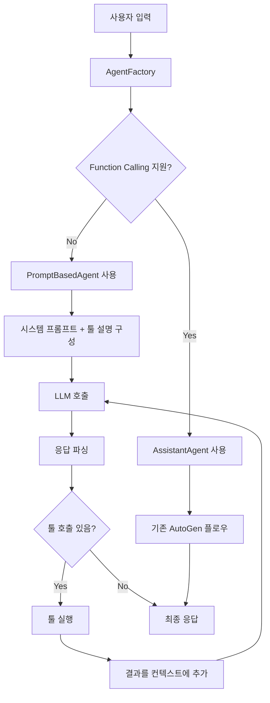

# AutoGen-MCP 프롬프트 기반 툴 호출 아키텍처

## 현재 아키텍처 분석

### 기존 구조
```
orchestrator/
├── agent_builder.py      # AssistantAgent 생성
├── llm_connector.py      # OpenAI 호환 LLM 클라이언트
├── mcp_tool_loader.py    # MCP 툴 로더
└── config.py            # 설정 관리
```

### 현재 문제점
- LLM이 function calling을 지원하지 않을 때 `ValueError` 발생
- AssistantAgent가 function calling에 의존적
- MCP 툴들이 사용되지 못함

## 제안 아키텍처: 프롬프트 기반 툴 호출 시스템

### 1. 설계 원칙
- **호환성**: function calling 지원/미지원 LLM 모두 지원
- **투명성**: 기존 인터페이스 유지
- **확장성**: 새로운 툴 추가 용이
- **신뢰성**: 프롬프트 파싱 오류 처리

### 2. 핵심 컴포넌트

#### 2.1 PromptBasedAgent
```python
class PromptBasedAgent:
    """프롬프트 기반으로 툴 호출을 처리하는 커스텀 에이전트"""

    def __init__(self, model_client, tools, system_message):
        self.model_client = model_client
        self.tools = {tool.name: tool for tool in tools}
        self.system_message = system_message

    async def run_stream(self, task: str):
        """스트리밍 방식으로 응답 생성"""
        pass
```

#### 2.2 ToolCallParser
```python
class ToolCallParser:
    """LLM 응답에서 툴 호출 명령을 파싱"""

    @staticmethod
    def parse_tool_calls(response: str) -> List[ToolCall]:
        """응답에서 툴 호출 추출"""
        pass

    @staticmethod
    def format_tool_result(tool_name: str, result: Any) -> str:
        """툴 실행 결과를 포맷팅"""
        pass
```

#### 2.3 AgentFactory
```python
class AgentFactory:
    """LLM 특성에 따라 적절한 에이전트 생성"""

    @staticmethod
    async def create_agent(llm_client, tools) -> Union[AssistantAgent, PromptBasedAgent]:
        """function calling 지원 여부에 따라 에이전트 선택"""
        pass
```

### 3. 프롬프트 설계

#### 3.1 시스템 프롬프트 템플릿
```
당신은 오케스트레이터 AI입니다. 사용자 질문을 분석하고 필요시 도구를 사용하세요.

사용 가능한 도구:
{tool_descriptions}

도구 호출 형식:
<tool_call>
<name>도구명</name>
<arguments>{"param": "value"}</arguments>
</tool_call>

규칙:
1. 도구가 필요한 경우에만 호출하세요
2. 정확한 JSON 형식의 인수를 사용하세요
3. 도구 호출 후 결과를 바탕으로 최종 답변을 제공하세요
4. 답변은 항상 질문과 동일한 언어로 하십시오
```

#### 3.2 툴 설명 자동 생성
```python
def generate_tool_descriptions(tools: List[Tool]) -> str:
    """MCP 툴들의 설명을 자동 생성"""
    descriptions = []
    for tool in tools:
        desc = f"- {tool.name}: {tool.description}"
        if tool.input_schema:
            desc += f"\n  매개변수: {tool.input_schema}"
        descriptions.append(desc)
    return "\n".join(descriptions)
```

### 4. 실행 플로우



### 5. 에러 처리 전략

#### 5.1 파싱 오류
- 잘못된 XML 형식: 재시도 또는 사용자에게 알림
- 존재하지 않는 툴: 사용 가능한 툴 목록 제공
- 잘못된 인수: 올바른 형식 예시 제공

#### 5.2 툴 실행 오류
- 네트워크 오류: 재시도 로직
- 인증 오류: 설정 확인 요청
- 타임아웃: 사용자에게 상황 알림

### 6. 성능 최적화

#### 6.1 캐싱
- 툴 설명 캐싱
- 빈번한 툴 호출 결과 캐싱
- 프롬프트 템플릿 캐싱

#### 6.2 스트리밍
- 부분적 응답 스트리밍
- 툴 실행 상태 실시간 업데이트
- 병렬 툴 호출 지원

### 7. 테스트 전략

#### 7.1 단위 테스트
- ToolCallParser 각 메서드
- AgentFactory 에이전트 선택 로직
- 프롬프트 템플릿 생성

#### 7.2 통합 테스트
- 실제 LLM과 MCP 툴 연동
- 다양한 시나리오 테스트
- 에러 상황 시뮬레이션

## 구현 계획

### Phase 1: 기본 구조
1. PromptBasedAgent 클래스 구현
2. ToolCallParser 구현
3. 기본 프롬프트 템플릿 작성

### Phase 2: 통합
1. AgentFactory 구현
2. 기존 agent_builder.py 수정
3. 설정 기반 에이전트 선택

### Phase 3: 최적화
1. 에러 처리 로직 구현
2. 스트리밍 기능 추가
3. 성능 최적화

### Phase 4: 테스트 및 검증
1. 단위/통합 테스트 작성
2. 다양한 LLM 환경에서 테스트
3. 문서화 및 예제 작성