# 데이터 흐름 다이어그램: Tool Calling 방식 비교

## 1. Function Calling 방식 상세 데이터 흐름

### 1.1 전체 시스템 흐름

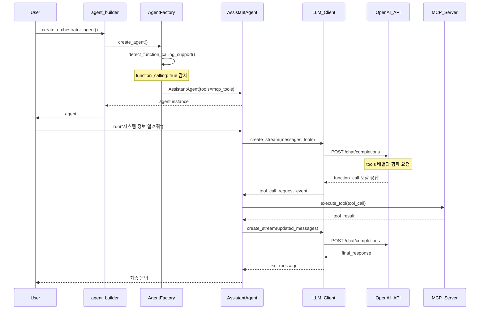

### 1.2 메시지 구조 변화

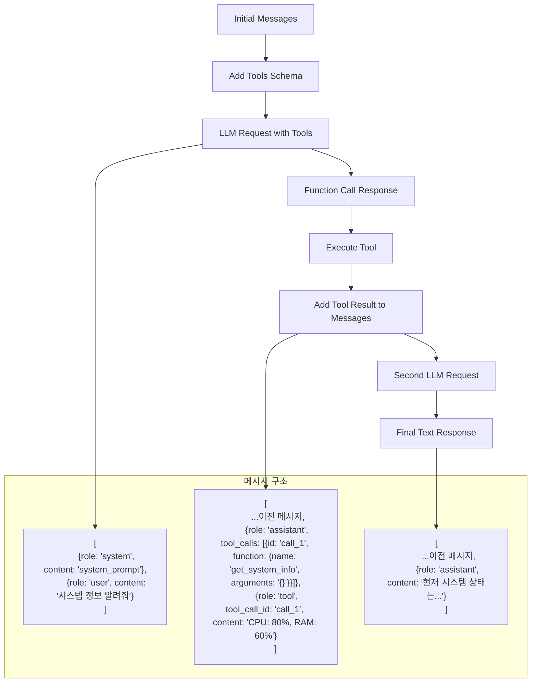

## 2. Prompt-Based 방식 상세 데이터 흐름

### 2.1 전체 시스템 흐름

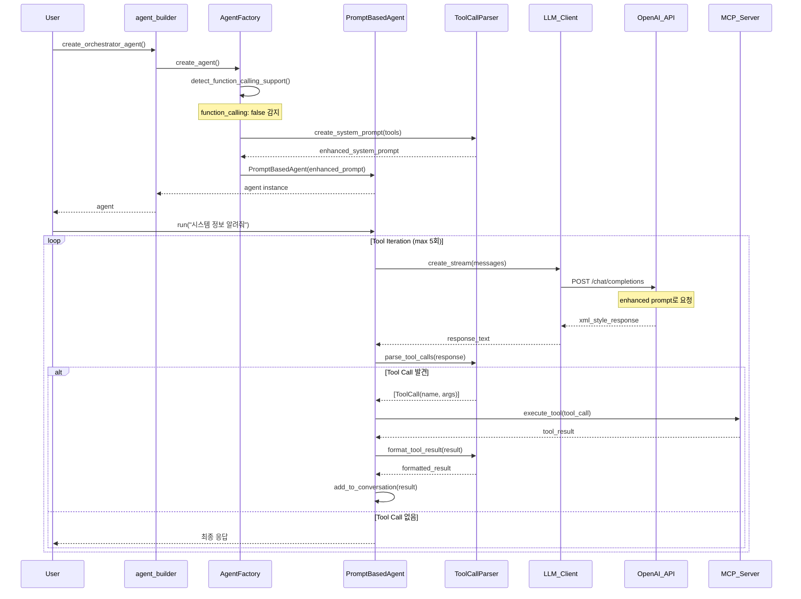

### 2.2 프롬프트 진화 과정

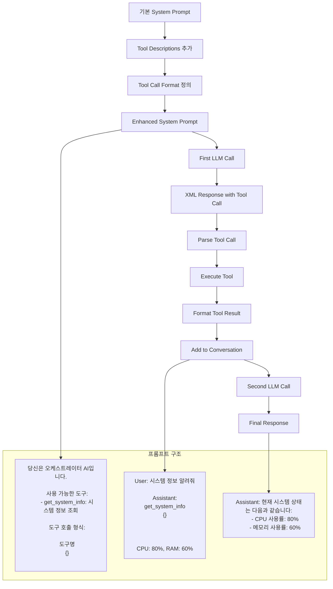

## 3. 에이전트 선택 플로우

### 3.1 AgentFactory 결정 로직

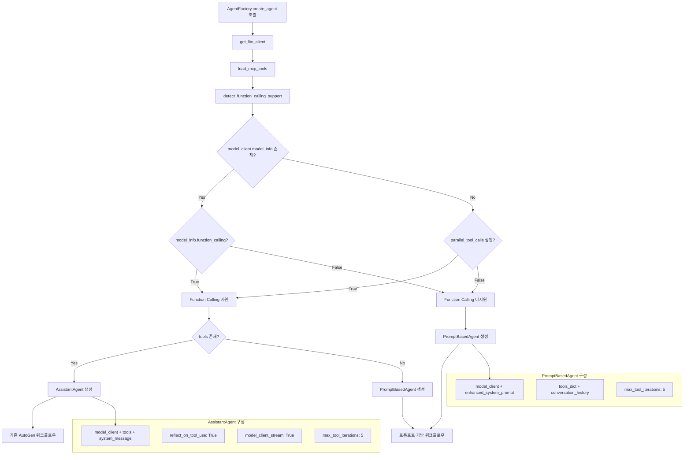

## 4. 메시지 처리 비교

### 4.1 Function Calling 메시지 플로우

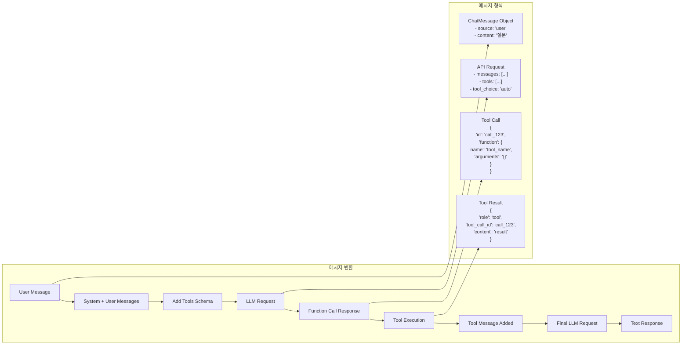

### 4.2 Prompt-Based 메시지 플로우

```mermaid
graph LR
    subgraph "메시지 변환"
        A[User Message] --> B[Enhanced System Prompt]
        B --> C[Conversation History]
        C --> D[LLM Request]
        D --> E[XML Response]
        E --> F[Parse Tool Calls]
        F --> G[Execute Tools]
        G --> H[Format Results]
        H --> I[Update Conversation]
        I --> J[Next LLM Request]
        J --> K[Final Response]
    end

    subgraph "데이터 구조"
        L["conversation_history = [
          {'role': 'system', 'content': 'enhanced_prompt'},
          {'role': 'user', 'content': '질문'}
        ]"]

        M["XML Response:
        '시스템 정보를 확인하겠습니다.

        <tool_call>
        <name>get_system_info</name>
        <arguments>{}</arguments>
        </tool_call>'"]

        N["Parsed ToolCall:
        ToolCall(
          name='get_system_info',
          arguments={}
        )"]

        O["Formatted Result:
        '<tool_result name=\"get_system_info\">
        CPU: 80%, RAM: 60%
        </tool_result>'"]
    end

    C --> L
    E --> M
    F --> N
    H --> O
```

## 5. 성능 및 리소스 사용 비교

### 5.1 토큰 사용량 분석

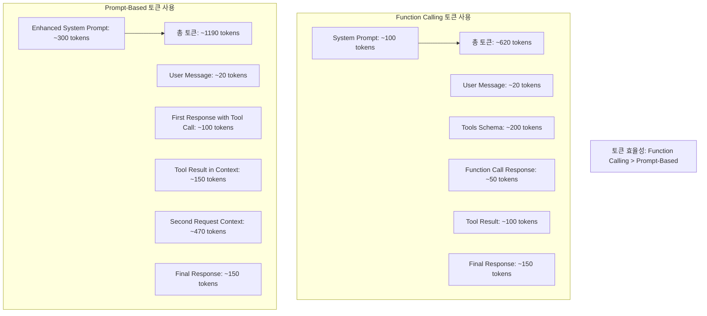

### 5.2 응답 시간 비교

```mermaid
gantt
    title 응답 시간 비교
    dateFormat X
    axisFormat %s

    section Function Calling
    LLM Request 1    :0, 2
    Tool Execution   :2, 3
    LLM Request 2    :3, 5
    Total Time       :0, 5

    section Prompt-Based
    LLM Request 1    :0, 2
    Parsing          :2, 2.2
    Tool Execution   :2.2, 3.2
    Context Building :3.2, 3.5
    LLM Request 2    :3.5, 5.5
    Total Time       :0, 5.5
```

## 6. 에러 처리 플로우

### 6.1 Function Calling 에러 처리

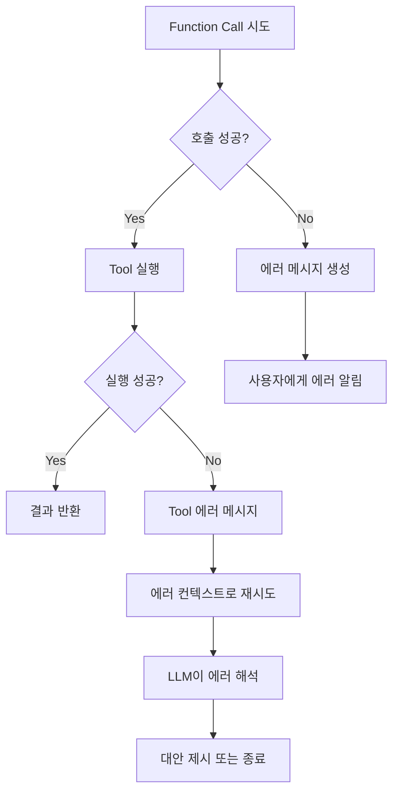

### 6.2 Prompt-Based 에러 처리

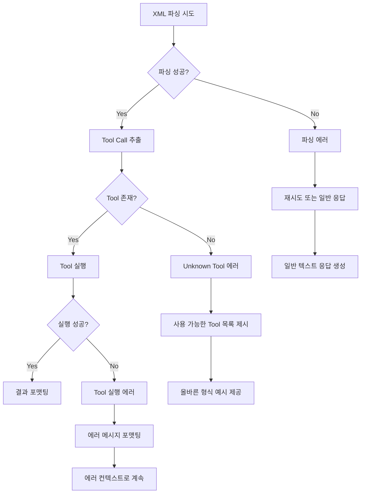

## 7. 확장성 및 유지보수성

### 7.1 새로운 Tool 추가 플로우

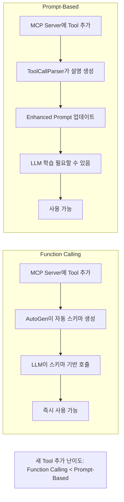

### 7.2 디버깅 복잡도

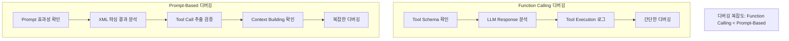

이 문서는 두 가지 Tool Calling 방식의 상세한 데이터 흐름과 아키텍처 차이를 시각적으로 비교 분석하여, 개발자가 적절한 방식을 선택할 수 있도록 도움을 제공합니다.