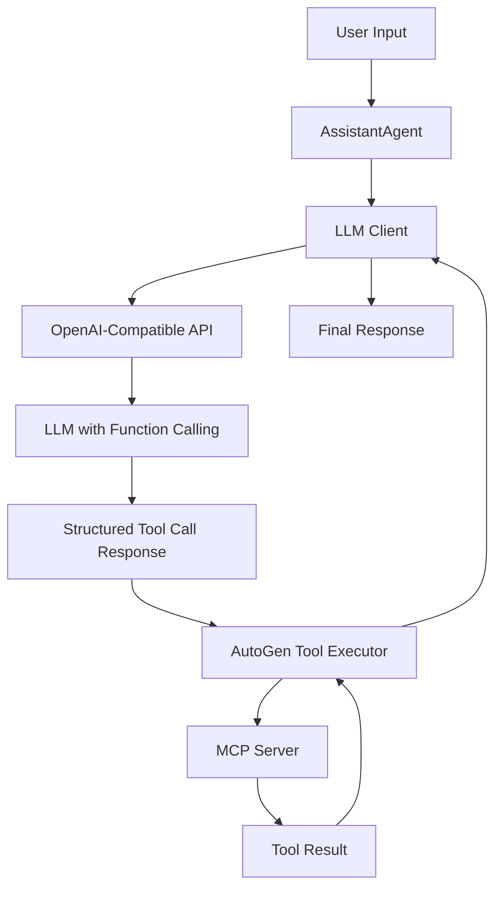
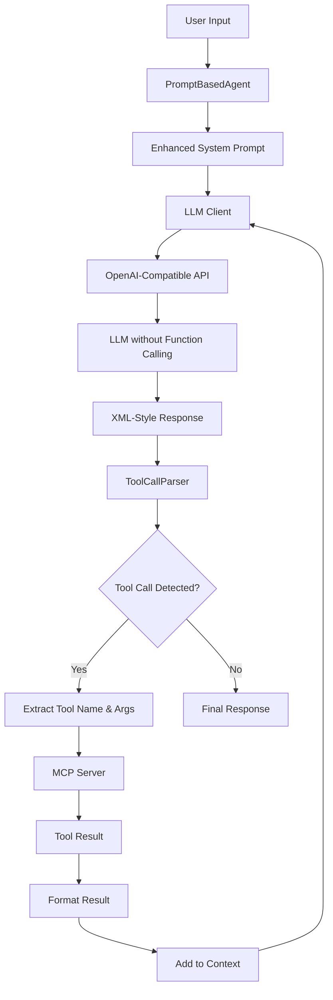
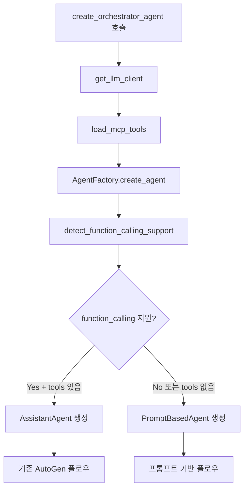

# Tool Calling 방식 비교: Function Calling vs Prompt-Based

## 개요

AutoGen-MCP 시스템에서 지원하는 두 가지 툴 호출 방식에 대한 상세한 비교 분석입니다.

## 1. 아키텍처 비교

### 1.1 Function Calling 기반 아키텍처 (기존 방식)



**핵심 컴포넌트:**
- `AssistantAgent`: AutoGen의 기본 에이전트
- `OpenAIChatCompletionClient`: OpenAI 호환 클라이언트
- `tools` 매개변수: MCP 툴들이 함수 스키마로 전달
- Native Function Calling: LLM이 직접 함수 호출 구조 생성

### 1.2 Prompt-Based 아키텍처 (새로운 방식)



**핵심 컴포넌트:**
- `PromptBasedAgent`: 새로 구현한 커스텀 에이전트
- `ToolCallParser`: XML 스타일 툴 호출 파싱
- Enhanced System Prompt: 툴 설명과 호출 형식 포함
- 반복적 LLM 호출: 툴 결과 반영 및 최종 응답 생성

## 2. 데이터 흐름 상세 비교

### 2.1 Function Calling 방식 데이터 흐름

#### 단계 1: 초기 설정
```json
{
  "model_info": {
    "function_calling": true,
    "parallel_tool_calls": true
  },
  "tools": [
    {
      "type": "function",
      "function": {
        "name": "get_system_info",
        "description": "시스템 정보를 가져옵니다",
        "parameters": {
          "type": "object",
          "properties": {}
        }
      }
    }
  ]
}
```

#### 단계 2: LLM 요청
```json
{
  "messages": [
    {"role": "system", "content": "당신은 오케스트레이터 AI입니다..."},
    {"role": "user", "content": "시스템 정보를 알려주세요"}
  ],
  "tools": [...],
  "tool_choice": "auto"
}
```

#### 단계 3: LLM 응답
```json
{
  "choices": [{
    "message": {
      "role": "assistant",
      "content": null,
      "tool_calls": [{
        "id": "call_123",
        "type": "function",
        "function": {
          "name": "get_system_info",
          "arguments": "{}"
        }
      }]
    }
  }]
}
```

#### 단계 4: 툴 실행 결과
```json
{
  "messages": [
    {"role": "tool", "tool_call_id": "call_123", "content": "CPU: 80%, Memory: 60%"}
  ]
}
```

### 2.2 Prompt-Based 방식 데이터 흐름

#### 단계 1: Enhanced System Prompt 생성
```text
당신은 오케스트레이터 AI입니다. 사용자 질문을 분석하고 필요시 도구를 사용하세요.

사용 가능한 도구:
- get_system_info: 시스템 정보를 가져옵니다
  매개변수: 없음

도구 호출 형식:
<tool_call>
<name>도구명</name>
<arguments>{"param": "value"}</arguments>
</tool_call>

규칙:
1. 도구가 필요한 경우에만 호출하세요
2. 정확한 JSON 형식의 인수를 사용하세요
3. 도구 호출 후 결과를 바탕으로 최종 답변을 제공하세요
```

#### 단계 2: 첫 번째 LLM 요청
```json
{
  "messages": [
    {"role": "system", "content": "Enhanced system prompt..."},
    {"role": "user", "content": "시스템 정보를 알려주세요"}
  ]
}
```

#### 단계 3: LLM 응답 (툴 호출 포함)
```text
시스템 정보를 확인해드리겠습니다.

<tool_call>
<name>get_system_info</name>
<arguments>{}</arguments>
</tool_call>
```

#### 단계 4: 툴 호출 파싱
```python
# ToolCallParser 결과
tool_calls = [
    ToolCall(name="get_system_info", arguments={})
]
```

#### 단계 5: 툴 실행 및 결과 포맷팅
```text
<tool_result name='get_system_info'>
CPU: 80%, Memory: 60%
</tool_result>
```

#### 단계 6: 두 번째 LLM 요청 (결과 포함)
```json
{
  "messages": [
    {"role": "system", "content": "Enhanced system prompt..."},
    {"role": "user", "content": "시스템 정보를 알려주세요"},
    {"role": "assistant", "content": "시스템 정보를 확인해드리겠습니다.\n\n<tool_call>...</tool_call>\n\n<tool_result>...</tool_result>"}
  ]
}
```

#### 단계 7: 최종 응답
```text
현재 시스템 상태는 다음과 같습니다:
- CPU 사용률: 80%
- 메모리 사용률: 60%

시스템 리소스가 다소 높게 사용되고 있습니다.
```

## 3. 주요 차이점 분석

### 3.1 기술적 차이점

| 구분 | Function Calling | Prompt-Based |
|------|------------------|--------------|
| **LLM 요구사항** | Function calling 지원 필수 | 텍스트 생성만 필요 |
| **API 의존성** | OpenAI Function Calling API | 표준 텍스트 생성 API |
| **파싱 복잡도** | 없음 (구조화된 응답) | XML 파싱 필요 |
| **오류 가능성** | 낮음 | 중간 (파싱 실패 가능) |
| **LLM 호출 횟수** | 1-2회 | 2-N회 (툴 결과마다) |

### 3.2 성능 비교

| 측면 | Function Calling | Prompt-Based |
|------|------------------|--------------|
| **응답 속도** | 빠름 | 중간 (추가 호출) |
| **정확도** | 매우 높음 | 높음 |
| **토큰 사용량** | 적음 | 많음 (프롬프트 오버헤드) |
| **안정성** | 매우 안정적 | 안정적 |

### 3.3 호환성 비교

| LLM 유형 | Function Calling | Prompt-Based |
|----------|------------------|--------------|
| **OpenAI GPT-4/3.5** | ✅ 완벽 지원 | ✅ 지원 |
| **Claude** | ✅ 완벽 지원 | ✅ 지원 |
| **로컬 LLM (Ollama)** | ❌ 대부분 미지원 | ✅ 지원 |
| **커스텀 모델** | ❌ 구현 필요 | ✅ 지원 |

## 4. 에이전트 선택 로직

### 4.1 AgentFactory 결정 과정



### 4.2 감지 알고리즘

```python
def detect_function_calling_support(model_client) -> bool:
    # 1. ModelInfo 확인
    if hasattr(model_client, 'model_info'):
        model_info = model_client.model_info
        if hasattr(model_info, 'function_calling'):
            return model_info.function_calling
        elif isinstance(model_info, dict):
            return model_info.get('function_calling', False)

    # 2. parallel_tool_calls 설정 확인
    if hasattr(model_client, 'parallel_tool_calls'):
        return model_client.parallel_tool_calls

    # 3. 기본값: 미지원
    return False
```

## 5. 실제 사용 시나리오

### 5.1 시나리오 1: OpenAI GPT-4 (Function Calling)

**설정:**
```python
LLM_CONFIG = {
    "base_url": "https://api.openai.com/v1",
    "model": "gpt-4",
    "api_key": "sk-..."
}
# function_calling: True로 자동 감지
```

**결과:** AssistantAgent 사용, 빠르고 정확한 툴 호출

### 5.2 시나리오 2: 로컬 Ollama 모델 (Prompt-Based)

**설정:**
```python
LLM_CONFIG = {
    "base_url": "http://127.0.0.1:11434/v1",
    "model": "llama2",
    "api_key": ""
}
# function_calling: False로 설정
```

**결과:** PromptBasedAgent 사용, 프롬프트 기반 툴 호출

## 6. 장단점 비교

### 6.1 Function Calling 방식

**장점:**
- ✅ 높은 정확도와 안정성
- ✅ 빠른 응답 속도
- ✅ 적은 토큰 사용량
- ✅ 병렬 툴 호출 지원
- ✅ 표준화된 인터페이스

**단점:**
- ❌ LLM 지원 제한적
- ❌ API 의존성 높음
- ❌ 커스텀 구현 어려움

### 6.2 Prompt-Based 방식

**장점:**
- ✅ 모든 LLM에서 동작
- ✅ 로컬 모델 지원
- ✅ 유연한 커스터마이징
- ✅ API 제약 없음
- ✅ 투명한 동작 과정

**단점:**
- ❌ 추가 LLM 호출 필요
- ❌ 파싱 오류 가능성
- ❌ 더 많은 토큰 사용
- ❌ 복잡한 구현

## 7. 최적화 권장사항

### 7.1 Function Calling 사용 시

1. **모델 선택**: GPT-4, Claude 등 안정적인 Function Calling 지원 모델
2. **툴 스키마**: 명확하고 간결한 설명 작성
3. **에러 처리**: 툴 호출 실패에 대한 적절한 처리

### 7.2 Prompt-Based 사용 시

1. **프롬프트 최적화**: 명확한 툴 호출 형식 제시
2. **파싱 로버스트**: 다양한 응답 형식에 대한 처리
3. **재시도 로직**: 파싱 실패 시 재시도 메커니즘
4. **토큰 관리**: 대화 히스토리 길이 제한

## 8. 결론

두 방식은 각각의 장단점이 있으며, 사용 환경에 따라 적절한 선택이 필요합니다:

- **상용 API 사용 시**: Function Calling 방식 권장
- **로컬/커스텀 모델 사용 시**: Prompt-Based 방식 권장
- **하이브리드 환경**: AgentFactory를 통한 자동 선택

AutoGen-MCP 시스템은 이 두 방식을 투명하게 지원하여 다양한 LLM 환경에서 일관된 툴 호출 경험을 제공합니다.